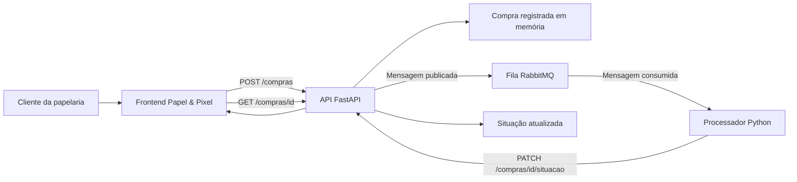

# Papel & Pixel - Processamento Assíncrono de Compras

Projeto desenvolvido para a disciplina de **Integração de Software - Unidade 4**.

Este projeto apresenta uma simulação de compra em uma papelaria online, utilizando uma arquitetura integrada com **Frontend**, **API RESTful em FastAPI**, **RabbitMQ** e um **serviço processador em Python**.

A proposta é demonstrar como uma aplicação pode receber uma solicitação do usuário e encaminhar essa solicitação para processamento posterior por meio de uma fila de mensagens.

---> Demonstração:

-----> Vídeo mostrando o sistema em funcionamento: https://youtu.be/yweQSEhDz3g

---

## Contexto da solução

A aplicação simula uma papelaria criativa chamada **Papel & Pixel**.

O usuário acessa uma página web, informa seu nome, escolhe um item de papelaria e define a quantidade desejada. A compra não é processada imediatamente. Primeiro, ela é registrada pela API com a situação **Aguardando processamento**.

Depois disso, a API envia uma mensagem para uma fila RabbitMQ. Um processador Python, executado separadamente, consome essa mensagem e simula a separação do item no estoque. Ao final, a situação da compra é atualizada para **Pedido confirmado** ou **Pedido recusado**.

---

## Objetivo

Projetar, implementar e documentar um ecossistema de integração de software com comunicação assíncrona, separando responsabilidades entre:

* interface do usuário;
* API de recebimento das compras;
* fila de mensagens;
* serviço processador;
* documentação e testes automatizados.

---

## Tecnologias utilizadas

* HTML
* CSS
* JavaScript
* Python
* FastAPI
* RabbitMQ
* Docker Compose
* Pytest
* GitHub Actions

---

## Estrutura do projeto

```text
papel-pixel-assincrono/
│
├── frontend/
│   ├── index.html
│   ├── styles.css
│   └── app.js
│
├── api/
│   ├── main.py
│   ├── memoria.py
│   ├── requirements.txt
│   └── test_api.py
│
├── worker/
│   ├── processador.py
│   └── requirements.txt
│
├── .github/
│   └── workflows/
│       └── testes.yml
│
├── docker-compose.yml
└── README.md
```

---

## Arquitetura da aplicação

A solução foi dividida em componentes independentes:

```text
Cliente
  ↓
Frontend Papel & Pixel
  ↓
API FastAPI
  ↓
Registro em memória
  ↓
Fila RabbitMQ
  ↓
Processador Python
  ↓
Atualização da situação da compra
  ↓
Consulta pelo frontend
```

---

## Diagrama de arquitetura



---

## Funcionamento do fluxo assíncrono

1. O usuário preenche o formulário no frontend.
2. O frontend envia os dados para a API.
3. A API valida a requisição e exige autenticação por token.
4. A compra é registrada com a situação **Aguardando processamento**.
5. A API publica uma mensagem na fila RabbitMQ.
6. O processador Python escuta a fila.
7. Ao receber uma mensagem, o processador simula a separação do item.
8. Após alguns segundos, o processador atualiza a situação da compra.
9. O frontend consulta a API e exibe a situação final para o usuário.

---

## Como executar o projeto

### 1. Subir o RabbitMQ

Na raiz do projeto, execute:

```bash
docker compose up -d
```

Para verificar se o container está ativo:

```bash
docker compose ps
```

O painel do RabbitMQ fica disponível em:

```text
http://localhost:15672
```

Credenciais de acesso:

```text
Usuário: guest
Senha: guest
```

---

### 2. Executar a API

Abra um terminal na pasta `api`:

```bash
cd api
```

Instale as dependências:

```bash
python -m pip install -r requirements.txt
```

Execute o servidor FastAPI:

```bash
python -m uvicorn main:app --reload
```

A API estará disponível em:

```text
http://localhost:8000
```

A documentação Swagger estará disponível em:

```text
http://localhost:8000/docs
```

---

### 3. Executar o processador

Abra outro terminal na pasta `worker`:

```bash
cd worker
```

Instale as dependências:

```bash
python -m pip install -r requirements.txt
```

Execute o processador:

```bash
python processador.py
```

O serviço ficará aguardando mensagens na fila RabbitMQ.

---

### 4. Executar o frontend

Abra o arquivo:

```text
frontend/index.html
```

Também é possível abrir com a extensão **Live Server** do VS Code.

---

## Segurança básica

A API utiliza autenticação simples por token Bearer.

Token utilizado:

```text
token-laise-2026
```

Exemplo de header:

```text
Authorization: Bearer token-laise-2026
```

As rotas de criação, consulta e atualização de compras exigem esse token.

---

## Endpoints da API

### GET /

Verifica se a API está ativa.

Exemplo de resposta:

```json
{
  "mensagem": "API Papel & Pixel funcionando. Sistema de compras assíncronas ativo."
}
```

---

### POST /compras

Cria uma nova compra e publica uma mensagem na fila RabbitMQ.

Exemplo de corpo da requisição:

```json
{
  "nome_cliente": "Laise",
  "item": "Caderno pontilhado",
  "quantidade": 2
}
```

Exemplo de resposta:

```json
{
  "mensagem": "Compra registrada e enviada para processamento.",
  "compra": {
    "id": "id-da-compra",
    "nome_cliente": "Laise",
    "item": "Caderno pontilhado",
    "quantidade": 2,
    "situacao": "Aguardando processamento"
  }
}
```

---

### GET /compras/{compra_id}

Consulta os dados e a situação atual de uma compra.

Exemplo de resposta:

```json
{
  "id": "id-da-compra",
  "nome_cliente": "Laise",
  "item": "Caderno pontilhado",
  "quantidade": 2,
  "situacao": "Pedido confirmado"
}
```

---

### PATCH /compras/{compra_id}/situacao

Atualiza a situação de uma compra.

Esse endpoint é utilizado pelo processador após consumir uma mensagem da fila.

Situações possíveis no projeto:

```text
Aguardando processamento
Pedido confirmado
Pedido recusado
```

---

## Testes automatizados

O projeto possui testes automatizados mínimos com Pytest.

Para executar os testes:

```bash
cd api
python -m pytest -v
```

Os testes verificam:

* funcionamento da rota inicial;
* bloqueio da criação de compra sem token;
* validação de quantidade inválida.

---

## CI/CD

O projeto inclui um workflow do GitHub Actions em:

```text
.github/workflows/testes.yml
```

O pipeline realiza as seguintes etapas:

1. Baixa o repositório.
2. Configura o Python.
3. Instala as dependências da API.
4. Executa os testes automatizados.


---

## Comandos úteis

Subir RabbitMQ:

```bash
docker compose up -d
```

Verificar containers:

```bash
docker compose ps
```

Executar API:

```bash
cd api
python -m uvicorn main:app --reload
```

Executar processador:

```bash
cd worker
python processador.py
```

Executar testes:

```bash
cd api
python -m pytest -v
```

